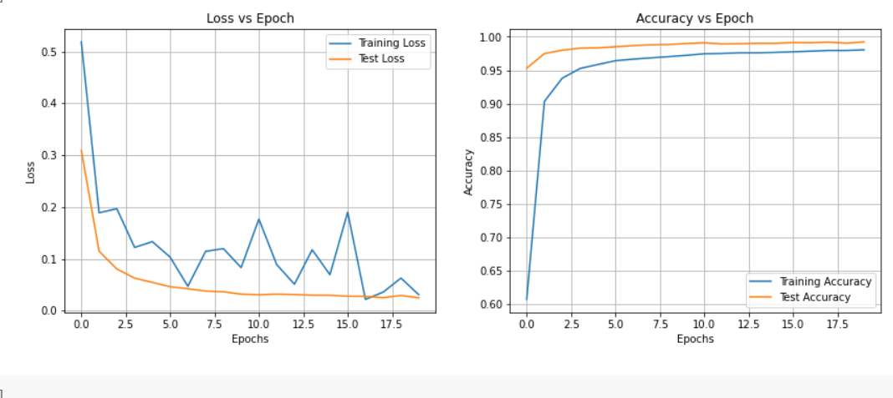
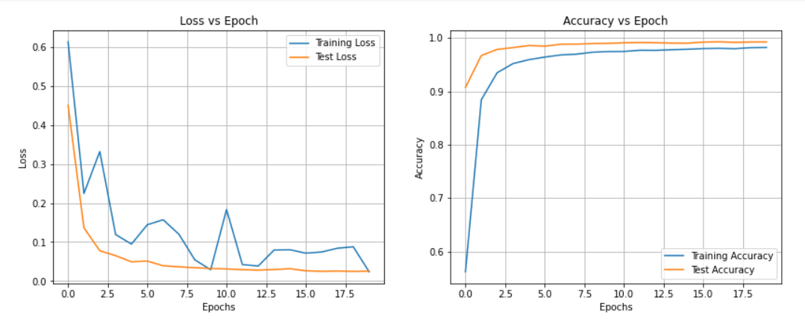
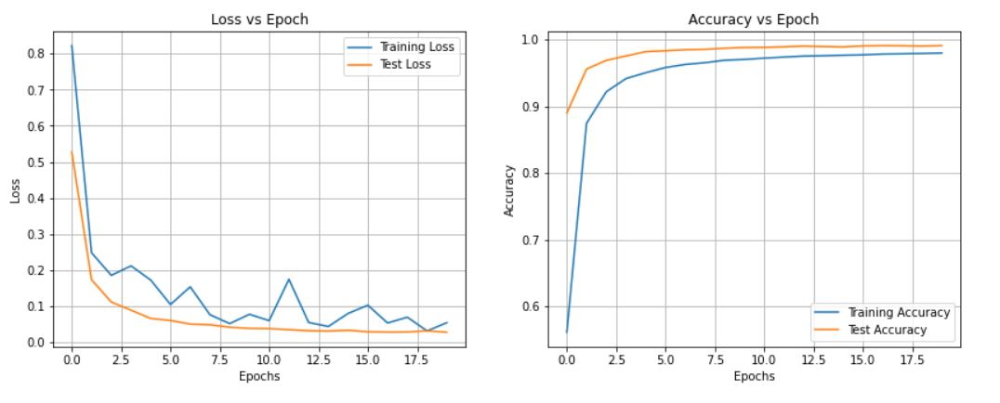
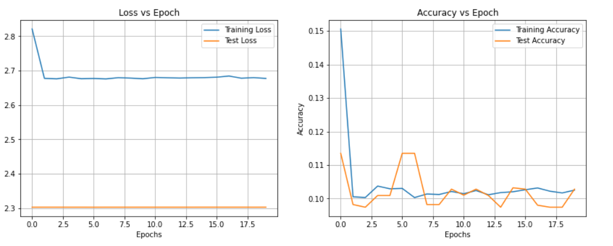
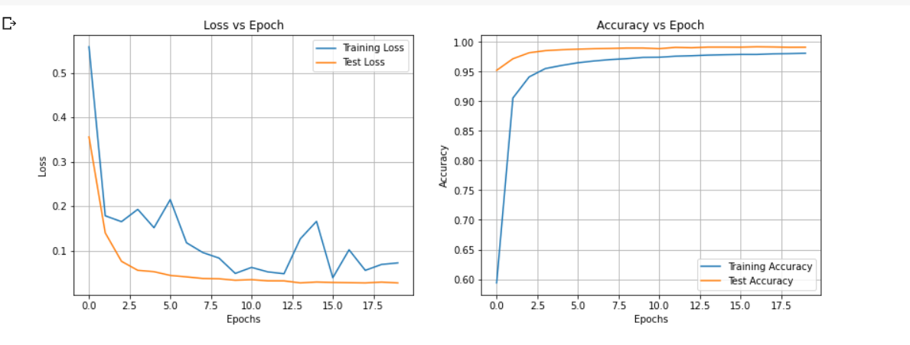
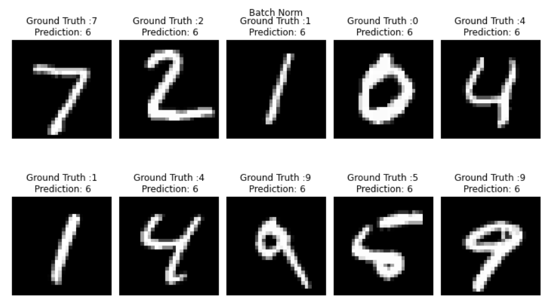

# Normalisation Techniques

To Build a :

- Network with Group Normalization
- Network with Layer Normalization
- Network with L1 + BN
- Network with L2 + BN

### Aproach to the problem statement
- Importing Libraries
- Downloading the dataset
- Defining the model with a choice  to chose the required Normalisation
- Getting the summary of the model
- Training the Network 
- Defining the oss function with L1 and L2
- plotting Graphs of accuracy and loss for different epochs
- visualising the misclassified and the classified data. 
## Defined Model

```python
class Net(nn.Module):
  def __init__(self, drop=0.05, norm='gn' , groups=4):
    
    super(Net, self).__init__()
    self.max_pool = nn.MaxPool2d(2,2)
    def Normalize(x):
      if norm == 'bn':
        return nn.BatchNorm2d(x)
      elif norm =='ln':
        return nn.GroupNorm(1,x)
      elif norm =='gn':
        return nn.GroupNorm(groups,x)
      else:
        return None

    self.conv_block1 = nn.Sequential(
        nn.Conv2d(1, 8, 3, padding=1, bias=False),
        Normalize(8),
        nn.ReLU(),
        nn.Dropout2d(drop),

        nn.Conv2d(8, 24, 3, padding=1, bias=False),
        Normalize(24),
        nn.ReLU(),
        nn.Dropout2d(drop),

       
    )

    self.transition1 = nn.Sequential(
        nn.Conv2d(24, 8, 1, bias=False),
        Normalize(8),
        nn.ReLU(),
        nn.Dropout2d(drop),
    )

    self.conv_block2 = nn.Sequential(
        nn.Conv2d(8, 16, 3, bias=False),
        Normalize(16),
        nn.ReLU(),
        nn.Dropout2d(drop),
 nn.Conv2d(16, 24, 3, bias=False),
        Normalize(24),
        nn.ReLU(),
        nn.Dropout2d(drop),
    )

    self.transition2 = nn.Sequential(
        nn.Conv2d(24, 8, 1, bias=False),
        Normalize(8),
        nn.ReLU(),
        nn.Dropout2d(drop),
    )
  
    self.conv_block3 = nn.Sequential(
        nn.Conv2d(8, 16, 3, bias=False),
        Normalize(16),
        nn.ReLU(),
        nn.Dropout2d(drop),

        nn.Conv2d(16, 32, 3, bias=False),
        Normalize(32),
        nn.ReLU(),
        nn.Dropout2d(drop),
    )

    self.gap = nn.Sequential(
        nn.AvgPool2d(6)
    )
    self.dense = nn.Linear(32, 10)

  def forward(self, x):
    x = self.conv_block1(x)
    x = self.max_pool(x)
    x = self.transition1(x)

    x = self.conv_block2(x)
    x = self.transition2(x)

    x = self.conv_block3(x)

    x = self.gap(x)
    x = x.view(-1, 32)    
    x = self.dense(x)

    return F.log_softmax(x, dim=1)
```

  Model Summary
   Layer (type)               Output Shape         Param #
================================================================
            Conv2d-1            [-1, 8, 28, 28]              72
         GroupNorm-2            [-1, 8, 28, 28]              16
              ReLU-3            [-1, 8, 28, 28]               0
         Dropout2d-4            [-1, 8, 28, 28]               0
            Conv2d-5           [-1, 24, 28, 28]           1,728
         GroupNorm-6           [-1, 24, 28, 28]              48
              ReLU-7           [-1, 24, 28, 28]               0
         Dropout2d-8           [-1, 24, 28, 28]               0
         MaxPool2d-9           [-1, 24, 14, 14]               0
           Conv2d-10            [-1, 8, 14, 14]             192
        GroupNorm-11            [-1, 8, 14, 14]              16
             ReLU-12            [-1, 8, 14, 14]               0
        Dropout2d-13            [-1, 8, 14, 14]               0
           Conv2d-14           [-1, 16, 12, 12]           1,152
        GroupNorm-15           [-1, 16, 12, 12]              32
             ReLU-16           [-1, 16, 12, 12]               0
        Dropout2d-17           [-1, 16, 12, 12]               0
           Conv2d-18           [-1, 24, 10, 10]           3,456
        GroupNorm-19           [-1, 24, 10, 10]              48
             ReLU-20           [-1, 24, 10, 10]               0
        Dropout2d-21           [-1, 24, 10, 10]               0
           Conv2d-22            [-1, 8, 10, 10]             192
        GroupNorm-23            [-1, 8, 10, 10]              16
             ReLU-24            [-1, 8, 10, 10]               0
        Dropout2d-25            [-1, 8, 10, 10]               0
           Conv2d-26             [-1, 16, 8, 8]           1,152
        GroupNorm-27             [-1, 16, 8, 8]              32
             ReLU-28             [-1, 16, 8, 8]               0
        Dropout2d-29             [-1, 16, 8, 8]               0
           Conv2d-30             [-1, 32, 6, 6]           4,608
        GroupNorm-31             [-1, 32, 6, 6]              64
             ReLU-32             [-1, 32, 6, 6]               0
        Dropout2d-33             [-1, 32, 6, 6]               0
        AvgPool2d-34             [-1, 32, 1, 1]               0
           Linear-35                   [-1, 10]             330
================================================================
- Total params: 13,154
- Trainable params: 13,154
- Non-trainable params: 0

Forward/backward pass size (MB): 1.08, 
Params size (MB): 0.05, 
Estimated Total Size (MB): 1.14


## Training the model with Batch Normalisation
1
loss=0.5184 batch_id=234: 100%|██████████| 235/235 [00:17<00:00, 13.17it/s]
Test set: Average loss: 0.3093, Accuracy: 9530/10000 (95.30%)

2
loss=0.1889 batch_id=234: 100%|██████████| 235/235 [00:17<00:00, 13.39it/s]
Test set: Average loss: 0.1148, Accuracy: 9749/10000 (97.49%)

3
loss=0.1966 batch_id=234: 100%|██████████| 235/235 [00:17<00:00, 13.21it/s]
Test set: Average loss: 0.0804, Accuracy: 9799/10000 (97.99%)

4
loss=0.1220 batch_id=234: 100%|██████████| 235/235 [00:17<00:00, 13.19it/s]
Test set: Average loss: 0.0628, Accuracy: 9830/10000 (98.30%)

5
loss=0.1332 batch_id=234: 100%|██████████| 235/235 [00:17<00:00, 13.19it/s]
Test set: Average loss: 0.0546, Accuracy: 9834/10000 (98.34%)

6
loss=0.1034 batch_id=234: 100%|██████████| 235/235 [00:17<00:00, 13.19it/s]
Test set: Average loss: 0.0462, Accuracy: 9851/10000 (98.51%)

7
loss=0.0471 batch_id=234: 100%|██████████| 235/235 [00:17<00:00, 13.27it/s]
Test set: Average loss: 0.0424, Accuracy: 9868/10000 (98.68%)

8
loss=0.1145 batch_id=234: 100%|██████████| 235/235 [00:17<00:00, 13.08it/s]
Test set: Average loss: 0.0378, Accuracy: 9880/10000 (98.80%)

9
loss=0.1197 batch_id=234: 100%|██████████| 235/235 [00:17<00:00, 13.14it/s]
Test set: Average loss: 0.0365, Accuracy: 9884/10000 (98.84%)

10
loss=0.0831 batch_id=234: 100%|██████████| 235/235 [00:17<00:00, 13.12it/s]
Test set: Average loss: 0.0319, Accuracy: 9899/10000 (98.99%)

11
loss=0.1767 batch_id=234: 100%|██████████| 235/235 [00:18<00:00, 13.05it/s]
Test set: Average loss: 0.0308, Accuracy: 9909/10000 (99.09%)

12
loss=0.0891 batch_id=234: 100%|██████████| 235/235 [00:17<00:00, 13.08it/s]
Test set: Average loss: 0.0319, Accuracy: 9893/10000 (98.93%)

13
loss=0.0511 batch_id=234: 100%|██████████| 235/235 [00:17<00:00, 13.17it/s]
Test set: Average loss: 0.0312, Accuracy: 9896/10000 (98.96%)

14
loss=0.1175 batch_id=234: 100%|██████████| 235/235 [00:17<00:00, 13.11it/s]
Test set: Average loss: 0.0299, Accuracy: 9902/10000 (99.02%)

15
loss=0.0694 batch_id=234: 100%|██████████| 235/235 [00:18<00:00, 13.02it/s]
Test set: Average loss: 0.0297, Accuracy: 9902/10000 (99.02%)

16
loss=0.1901 batch_id=234: 100%|██████████| 235/235 [00:17<00:00, 13.21it/s]
Test set: Average loss: 0.0280, Accuracy: 9914/10000 (99.14%)

17
loss=0.0218 batch_id=234: 100%|██████████| 235/235 [00:17<00:00, 13.32it/s]
Test set: Average loss: 0.0276, Accuracy: 9911/10000 (99.11%)

18
loss=0.0359 batch_id=234: 100%|██████████| 235/235 [00:18<00:00, 12.96it/s]
Test set: Average loss: 0.0252, Accuracy: 9920/10000 (99.20%)

19
loss=0.0629 batch_id=234: 100%|██████████| 235/235 [00:18<00:00, 13.02it/s]
Test set: Average loss: 0.0294, Accuracy: 9904/10000 (99.04%)

20
loss=0.0309 batch_id=234: 100%|██████████| 235/235 [00:17<00:00, 13.06it/s]
Test set: Average loss: 0.0249, Accuracy: 9924/10000 (99.24%)

## Training the model with Group Normalisation

1
loss=0.6137 batch_id=234: 100%|██████████| 235/235 [00:17<00:00, 13.12it/s]
Test set: Average loss: 0.4509, Accuracy: 9075/10000 (90.75%)

2
loss=0.2245 batch_id=234: 100%|██████████| 235/235 [00:18<00:00, 12.95it/s]
Test set: Average loss: 0.1367, Accuracy: 9671/10000 (96.71%)

3
loss=0.3323 batch_id=234: 100%|██████████| 235/235 [00:18<00:00, 12.94it/s]
Test set: Average loss: 0.0776, Accuracy: 9786/10000 (97.86%)

4
loss=0.1193 batch_id=234: 100%|██████████| 235/235 [00:18<00:00, 12.92it/s]
Test set: Average loss: 0.0651, Accuracy: 9820/10000 (98.20%)

5
loss=0.0947 batch_id=234: 100%|██████████| 235/235 [00:18<00:00, 12.86it/s]
Test set: Average loss: 0.0493, Accuracy: 9859/10000 (98.59%)

6
loss=0.1444 batch_id=234: 100%|██████████| 235/235 [00:18<00:00, 12.92it/s]
Test set: Average loss: 0.0512, Accuracy: 9848/10000 (98.48%)

7
loss=0.1572 batch_id=234: 100%|██████████| 235/235 [00:17<00:00, 13.18it/s]
Test set: Average loss: 0.0392, Accuracy: 9882/10000 (98.82%)

8
loss=0.1198 batch_id=234: 100%|██████████| 235/235 [00:18<00:00, 12.94it/s]
Test set: Average loss: 0.0364, Accuracy: 9886/10000 (98.86%)

9
loss=0.0543 batch_id=234: 100%|██████████| 235/235 [00:17<00:00, 13.18it/s]
Test set: Average loss: 0.0343, Accuracy: 9895/10000 (98.95%)

10
loss=0.0290 batch_id=234: 100%|██████████| 235/235 [00:18<00:00, 12.97it/s]
Test set: Average loss: 0.0321, Accuracy: 9900/10000 (99.00%)

11
loss=0.1835 batch_id=234: 100%|██████████| 235/235 [00:17<00:00, 13.13it/s]
Test set: Average loss: 0.0310, Accuracy: 9910/10000 (99.10%)

12
loss=0.0422 batch_id=234: 100%|██████████| 235/235 [00:18<00:00, 12.97it/s]
Test set: Average loss: 0.0291, Accuracy: 9915/10000 (99.15%)

13
loss=0.0385 batch_id=234: 100%|██████████| 235/235 [00:18<00:00, 13.04it/s]
Test set: Average loss: 0.0280, Accuracy: 9911/10000 (99.11%)

14
loss=0.0795 batch_id=234: 100%|██████████| 235/235 [00:18<00:00, 12.99it/s]
Test set: Average loss: 0.0295, Accuracy: 9905/10000 (99.05%)

15
loss=0.0803 batch_id=234: 100%|██████████| 235/235 [00:18<00:00, 12.97it/s]
Test set: Average loss: 0.0317, Accuracy: 9903/10000 (99.03%)

16
loss=0.0715 batch_id=234: 100%|██████████| 235/235 [00:18<00:00, 12.88it/s]
Test set: Average loss: 0.0262, Accuracy: 9923/10000 (99.23%)

17
loss=0.0745 batch_id=234: 100%|██████████| 235/235 [00:18<00:00, 12.84it/s]
Test set: Average loss: 0.0250, Accuracy: 9928/10000 (99.28%)

18
loss=0.0842 batch_id=234: 100%|██████████| 235/235 [00:18<00:00, 12.94it/s]
Test set: Average loss: 0.0257, Accuracy: 9919/10000 (99.19%)

19
loss=0.0879 batch_id=234: 100%|██████████| 235/235 [00:18<00:00, 12.95it/s]
Test set: Average loss: 0.0248, Accuracy: 9925/10000 (99.25%)

20
loss=0.0237 batch_id=234: 100%|██████████| 235/235 [00:18<00:00, 12.86it/s]
Test set: Average loss: 0.0255, Accuracy: 9926/10000 (99.26%)

## Training the model with Layer Normalisation
1
loss=0.8220 batch_id=234: 100%|██████████| 235/235 [00:18<00:00, 12.75it/s]
Test set: Average loss: 0.5274, Accuracy: 8901/10000 (89.01%)

2
loss=0.2485 batch_id=234: 100%|██████████| 235/235 [00:18<00:00, 12.88it/s]
Test set: Average loss: 0.1740, Accuracy: 9559/10000 (95.59%)

3
loss=0.1860 batch_id=234: 100%|██████████| 235/235 [00:18<00:00, 12.90it/s]
Test set: Average loss: 0.1121, Accuracy: 9689/10000 (96.89%)

4
loss=0.2122 batch_id=234: 100%|██████████| 235/235 [00:18<00:00, 13.01it/s]
Test set: Average loss: 0.0896, Accuracy: 9756/10000 (97.56%)

5
loss=0.1728 batch_id=234: 100%|██████████| 235/235 [00:17<00:00, 13.17it/s]
Test set: Average loss: 0.0666, Accuracy: 9820/10000 (98.20%)

6
loss=0.1053 batch_id=234: 100%|██████████| 235/235 [00:18<00:00, 13.01it/s]
Test set: Average loss: 0.0610, Accuracy: 9833/10000 (98.33%)

7
loss=0.1542 batch_id=234: 100%|██████████| 235/235 [00:18<00:00, 12.84it/s]
Test set: Average loss: 0.0510, Accuracy: 9849/10000 (98.49%)

8
loss=0.0769 batch_id=234: 100%|██████████| 235/235 [00:18<00:00, 13.01it/s]
Test set: Average loss: 0.0492, Accuracy: 9854/10000 (98.54%)

9
loss=0.0523 batch_id=234: 100%|██████████| 235/235 [00:18<00:00, 12.81it/s]
Test set: Average loss: 0.0423, Accuracy: 9871/10000 (98.71%)

10
loss=0.0781 batch_id=234: 100%|██████████| 235/235 [00:18<00:00, 12.98it/s]
Test set: Average loss: 0.0392, Accuracy: 9882/10000 (98.82%)

11
loss=0.0606 batch_id=234: 100%|██████████| 235/235 [00:18<00:00, 12.83it/s]
Test set: Average loss: 0.0385, Accuracy: 9884/10000 (98.84%)

12
loss=0.1751 batch_id=234: 100%|██████████| 235/235 [00:18<00:00, 13.05it/s]
Test set: Average loss: 0.0356, Accuracy: 9892/10000 (98.92%)

13
loss=0.0554 batch_id=234: 100%|██████████| 235/235 [00:18<00:00, 12.99it/s]
Test set: Average loss: 0.0325, Accuracy: 9904/10000 (99.04%)

14
loss=0.0444 batch_id=234: 100%|██████████| 235/235 [00:18<00:00, 12.94it/s]
Test set: Average loss: 0.0318, Accuracy: 9896/10000 (98.96%)

15
loss=0.0806 batch_id=234: 100%|██████████| 235/235 [00:18<00:00, 12.78it/s]
Test set: Average loss: 0.0338, Accuracy: 9891/10000 (98.91%)

16
loss=0.1033 batch_id=234: 100%|██████████| 235/235 [00:17<00:00, 13.08it/s]
Test set: Average loss: 0.0297, Accuracy: 9906/10000 (99.06%)

17
loss=0.0540 batch_id=234: 100%|██████████| 235/235 [00:18<00:00, 12.95it/s]
Test set: Average loss: 0.0287, Accuracy: 9910/10000 (99.10%)

18
loss=0.0701 batch_id=234: 100%|██████████| 235/235 [00:18<00:00, 12.98it/s]
Test set: Average loss: 0.0290, Accuracy: 9908/10000 (99.08%)

19
loss=0.0321 batch_id=234: 100%|██████████| 235/235 [00:18<00:00, 12.87it/s]
Test set: Average loss: 0.0326, Accuracy: 9904/10000 (99.04%)

20
loss=0.0549 batch_id=234: 100%|██████████| 235/235 [00:18<00:00, 12.91it/s]
Test set: Average loss: 0.0283, Accuracy: 9910/10000 (99.10%)

## Training the Model with Batch Normalisation + L1
1
loss=2.7249 batch_id=234: 100%|██████████| 235/235 [00:18<00:00, 12.44it/s]
Test set: Average loss: 2.3026, Accuracy: 1032/10000 (10.32%)

2
loss=2.6802 batch_id=234: 100%|██████████| 235/235 [00:18<00:00, 12.44it/s]
Test set: Average loss: 2.3026, Accuracy: 980/10000 (9.80%)

3
loss=2.6807 batch_id=234: 100%|██████████| 235/235 [00:18<00:00, 12.43it/s]
Test set: Average loss: 2.3026, Accuracy: 958/10000 (9.58%)

4
loss=2.6784 batch_id=234: 100%|██████████| 235/235 [00:18<00:00, 12.43it/s]
Test set: Average loss: 2.3026, Accuracy: 958/10000 (9.58%)

5
loss=2.6793 batch_id=234: 100%|██████████| 235/235 [00:19<00:00, 12.36it/s]
Test set: Average loss: 2.3026, Accuracy: 974/10000 (9.74%)

6
loss=2.6826 batch_id=234: 100%|██████████| 235/235 [00:19<00:00, 12.35it/s]
Test set: Average loss: 2.3026, Accuracy: 980/10000 (9.80%)

7
loss=2.6806 batch_id=234: 100%|██████████| 235/235 [00:18<00:00, 12.50it/s]
Test set: Average loss: 2.3026, Accuracy: 892/10000 (8.92%)

8
loss=2.6846 batch_id=234: 100%|██████████| 235/235 [00:18<00:00, 12.43it/s]
Test set: Average loss: 2.3026, Accuracy: 1028/10000 (10.28%)

9
loss=2.6769 batch_id=234: 100%|██████████| 235/235 [00:18<00:00, 12.45it/s]
Test set: Average loss: 2.3026, Accuracy: 974/10000 (9.74%)

10
loss=2.6813 batch_id=234: 100%|██████████| 235/235 [00:18<00:00, 12.43it/s]
Test set: Average loss: 2.3026, Accuracy: 980/10000 (9.80%)

11
loss=2.6793 batch_id=234: 100%|██████████| 235/235 [00:18<00:00, 12.42it/s]
Test set: Average loss: 2.3026, Accuracy: 1028/10000 (10.28%)

12
loss=2.6812 batch_id=234: 100%|██████████| 235/235 [00:18<00:00, 12.50it/s]
Test set: Average loss: 2.3026, Accuracy: 1010/10000 (10.10%)

13
loss=2.6811 batch_id=234: 100%|██████████| 235/235 [00:18<00:00, 12.41it/s]
Test set: Average loss: 2.3026, Accuracy: 1028/10000 (10.28%)

14
loss=2.6818 batch_id=234: 100%|██████████| 235/235 [00:18<00:00, 12.45it/s]
Test set: Average loss: 2.3026, Accuracy: 892/10000 (8.92%)

15
loss=2.6799 batch_id=234: 100%|██████████| 235/235 [00:18<00:00, 12.47it/s]
Test set: Average loss: 2.3026, Accuracy: 1028/10000 (10.28%)

16
loss=2.6786 batch_id=234: 100%|██████████| 235/235 [00:18<00:00, 12.37it/s]
Test set: Average loss: 2.3026, Accuracy: 974/10000 (9.74%)

17
loss=2.6756 batch_id=234: 100%|██████████| 235/235 [00:18<00:00, 12.38it/s]
Test set: Average loss: 2.3026, Accuracy: 958/10000 (9.58%)

18
loss=2.6831 batch_id=234: 100%|██████████| 235/235 [00:19<00:00, 12.35it/s]
Test set: Average loss: 2.3026, Accuracy: 1028/10000 (10.28%)

19
loss=2.6814 batch_id=234: 100%|██████████| 235/235 [00:18<00:00, 12.40it/s]
Test set: Average loss: 2.3025, Accuracy: 1135/10000 (11.35%)

20
loss=2.6766 batch_id=234: 100%|██████████| 235/235 [00:18<00:00, 12.39it/s]
Test set: Average loss: 2.3026, Accuracy: 980/10000 (9.80%)

## Batch Noemalisation and L2
1
loss=0.6493 batch_id=234: 100%|██████████| 235/235 [00:18<00:00, 12.72it/s]
Test set: Average loss: 0.4335, Accuracy: 9271/10000 (92.71%)

2
loss=0.1900 batch_id=234: 100%|██████████| 235/235 [00:18<00:00, 12.87it/s]
Test set: Average loss: 0.1180, Accuracy: 9775/10000 (97.75%)

3
loss=0.2944 batch_id=234: 100%|██████████| 235/235 [00:18<00:00, 12.81it/s]
Test set: Average loss: 0.0776, Accuracy: 9823/10000 (98.23%)

4
loss=0.1461 batch_id=234: 100%|██████████| 235/235 [00:18<00:00, 12.75it/s]
Test set: Average loss: 0.0550, Accuracy: 9861/10000 (98.61%)

5
loss=0.1033 batch_id=234: 100%|██████████| 235/235 [00:18<00:00, 13.03it/s]
Test set: Average loss: 0.0490, Accuracy: 9868/10000 (98.68%)

6
loss=0.1282 batch_id=234: 100%|██████████| 235/235 [00:18<00:00, 12.99it/s]
Test set: Average loss: 0.0430, Accuracy: 9882/10000 (98.82%)

7
loss=0.0987 batch_id=234: 100%|██████████| 235/235 [00:18<00:00, 12.90it/s]
Test set: Average loss: 0.0370, Accuracy: 9890/10000 (98.90%)

8
loss=0.0558 batch_id=234: 100%|██████████| 235/235 [00:18<00:00, 12.77it/s]
Test set: Average loss: 0.0357, Accuracy: 9895/10000 (98.95%)

9
loss=0.0542 batch_id=234: 100%|██████████| 235/235 [00:18<00:00, 12.95it/s]
Test set: Average loss: 0.0366, Accuracy: 9900/10000 (99.00%)

10
loss=0.0330 batch_id=234: 100%|██████████| 235/235 [00:18<00:00, 12.75it/s]
Test set: Average loss: 0.0319, Accuracy: 9907/10000 (99.07%)

11
loss=0.1169 batch_id=234: 100%|██████████| 235/235 [00:18<00:00, 12.81it/s]
Test set: Average loss: 0.0319, Accuracy: 9907/10000 (99.07%)

12
loss=0.0419 batch_id=234: 100%|██████████| 235/235 [00:18<00:00, 12.73it/s]
Test set: Average loss: 0.0296, Accuracy: 9912/10000 (99.12%)

13
loss=0.0454 batch_id=234: 100%|██████████| 235/235 [00:18<00:00, 12.84it/s]
Test set: Average loss: 0.0283, Accuracy: 9909/10000 (99.09%)

14
loss=0.0399 batch_id=234: 100%|██████████| 235/235 [00:18<00:00, 12.91it/s]
Test set: Average loss: 0.0279, Accuracy: 9908/10000 (99.08%)

15
loss=0.0795 batch_id=234: 100%|██████████| 235/235 [00:18<00:00, 12.84it/s]
Test set: Average loss: 0.0283, Accuracy: 9921/10000 (99.21%)

16
loss=0.0456 batch_id=234: 100%|██████████| 235/235 [00:18<00:00, 12.76it/s]
Test set: Average loss: 0.0272, Accuracy: 9911/10000 (99.11%)

17
loss=0.0950 batch_id=234: 100%|██████████| 235/235 [00:18<00:00, 12.80it/s]
Test set: Average loss: 0.0259, Accuracy: 9921/10000 (99.21%)

18
loss=0.0993 batch_id=234: 100%|██████████| 235/235 [00:18<00:00, 12.70it/s]
Test set: Average loss: 0.0258, Accuracy: 9916/10000 (99.16%)

19
loss=0.0827 batch_id=234: 100%|██████████| 235/235 [00:18<00:00, 12.79it/s]
Test set: Average loss: 0.0249, Accuracy: 9917/10000 (99.17%)

20
loss=0.0150 batch_id=234: 100%|██████████| 235/235 [00:18<00:00, 12.76it/s]
Test set: Average loss: 0.0259, Accuracy: 9914/10000 (99.14%)

##  The loss curve and accuracy curve against different Epochs 
### Batch Normalisation

### Group Normalisation

### Layer Normalisation

### Batch Normalisation +L1

### Batch Normalisation +L2


## Visualising  the Miscassified and Classified Data
### Misclassified Images

### Classified Images

